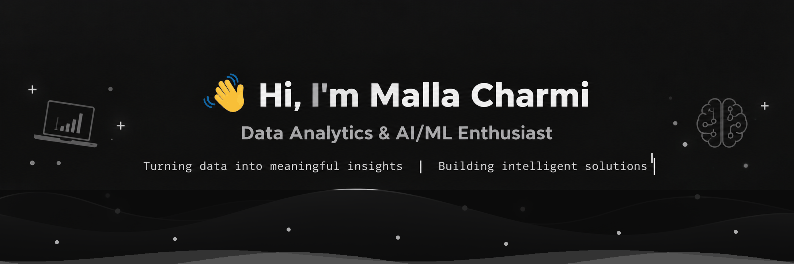

---

## 👩‍💻 About Me

- 🎓 B.Tech CSE (AI & ML) student at Aditya University
- 📊 Interested in Data Analytics, Business Intelligence and Machine Learning
- 🐍 Working with Python, SQL, Pandas and NumPy
- 📈 Building dashboards and data-driven solutions using Power BI and Excel
- 🤖 Exploring Machine Learning, Deep Learning and Generative AI
- 🔍 Interested in solving real-world problems using data
- 💼 Open to Data Analyst, AI/ML and Business Intelligence opportunities

---

## 🛠️ Tech Stack

### Programming & Query Languages

### Data Analytics

### Machine Learning & AI

### Tools & Platforms

---

## 🚀 Featured Projects

| Project | Technologies | Description |
|---|---|---|
| 🌧️ [Rainfall Prediction](https://github.com/mallacharmi/Rainfall_Prediction_With_HourlyData) | Python, TensorFlow, Keras, ML | Deep learning based rainfall prediction using historical weather data |
| 📊 [Amazon Sales Dashboard](https://github.com/mallacharmi/Amazon_Sales_Dashboard) | Power BI, Excel | Interactive sales dashboard for business insights and KPI analysis |
| 🤖 [AI Interview Preparation System](https://github.com/mallacharmi/InterviewPrepAI) | Java, Spring Boot, MySQL, REST API, LLM API | AI-powered platform for personalized interview preparation, question generation and answer evaluation |
| 👥 [Employee Attendance Tracker](https://github.com/mallacharmi/Employee-Attendance-Tracker) | Python | Employee attendance tracking and management system |
| 🏫 [Campus ReShare Hub](https://github.com/Chopra-14/campus_reshare_hub) | HTML5, CSS3, JavaScript, Firebase, TensorFlow.js | AI-assisted campus lost & found and student marketplace platform |

---

## 📊 GitHub Stats

---

## 🔥 GitHub Streak

---

## 🏆 Achievements & Experience

- 📊 Built data analytics dashboards using Power BI and Excel
- 🐍 Developed Python-based data analysis and machine learning projects
- 🤖 Worked on Machine Learning and Deep Learning projects
- 📈 Hands-on experience with SQL and data visualization
- 🔬 Research Intern at CSIR–Fourth Paradigm Institute (CSIR-4PI)
- 💼 Data Specialist Intern at Technical Hub Pvt Ltd
- 🚀 Interested in Data Analyst and AI/ML opportunities

---

## 📜 Certifications

- 🟠 [AWS Certified AI Practitioner (2025)](https://www.credly.com/badges/bb76a8a5-bb70-48a3-97c6-1dec31187428/public_url)
- 🟠 [AWS Certified Data Engineer – Associate (2026)](https://www.credly.com/badges/44e92a90-75df-472d-a1af-afadfce293d5/public_url)
- ❄️ [Snowflake SnowPro Associate: Platform (2025)](https://drive.google.com/file/d/1LJf7DzShgAOHENRl19zzEmeXQk8T-knN/view?usp=drive_link)
- 🟦 [Microsoft Power Platform Solution Architect Expert (2026)](https://drive.google.com/file/d/1rIvRmaYxAA6eq-_G2Xks2jhhzh_6lPWs/view?usp=sharing)
- 🟦 [Microsoft Power Platform Solution Associate (2026)](https://drive.google.com/file/d/1K3UEHy-k7jwlnXy8ohj586UUV4Azl_zN/view?usp=sharing)
- 🐍 [IBM SkillBuild – Python 101 for Data Science (2026)](https://www.credly.com/badges/9eb816fd-bbf5-4f05-b544-a5d1daa0ced2/public_url)
- 🌐 [Cisco Networking Academy – Programming Essentials in Python](https://www.credly.com/badges/e900b69d-3faa-4682-8670-70d764e8aafd/public_url)

---

## 🤝 Let's Connect

---

### 📊 Turning Data Into Insights | 🤖 Building Intelligent Solutions | 🚀 Learning Every Day

